# Trading PSNR for Perceptual Sharpness: NeRF with σ-Controlled Gaussian Fourier Features

## 0.1. Code repository and experiment logs

GitHub: https://github.com/zhelianl-zl/Nerf_IDL_gauss  

Weights & Biases dashboard: https://wandb.ai/zhelianl-carnegie-mellon-university/Nerf_IDL_gauss_finnal?nw=nwuserzhelianl

---

## 1. Baseline NeRF vs. Fourier-only NeRF

The NeRF model with the original log-band positional encoding and the variant that replaces it with standard Fourier features show almost identical behavior: their PSNR/SSIM curves overlap and the depth-uncertainty (grayscale z_std) maps are visually very similar. This suggests that, for this flower scene and training budget, the original NeRF positional encoding already provides sufficient frequency coverage. Switching to another fixed Fourier scheme (or slightly modifying the Fourier parameters) does not yield a measurable improvement in reconstruction quality.

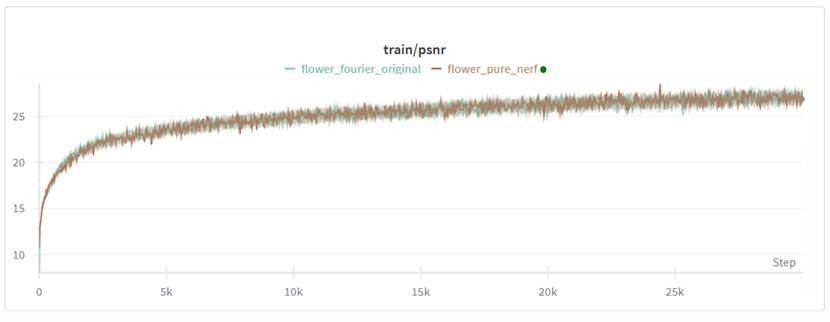
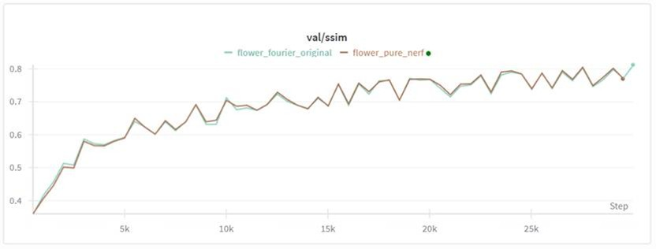
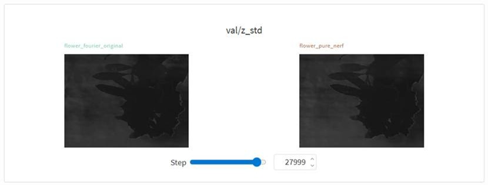

---

## 2. Effect of Gaussian Fourier Features and σ

After introducing Gaussian Fourier features and using σ to control the frequency bandwidth, the rendered depth maps show that object boundaries become noticeably sharper: the uncertainty regions around leaves and petals are narrower and more clearly defined than in the baseline NeRF.

By sweeping different σ values, we found that σ = 1.8 offers the best trade-off among:

- sharper edges in the reconstructed images, and  
- quantitative metrics (PSNR, SSIM).

Although PSNR/SSIM at σ = 1.8 are still slightly lower than those of pure NeRF / Fourier-only NeRF, the gap is small. In other words, Gaussian Fourier with σ = 1.8 significantly improves perceived edge sharpness while only marginally degrading PSNR and SSIM.

Intuitively, the ground-truth images already contain some blur (camera optics, downsampling, etc.). Gaussian Fourier adds extra high-frequency detail, which makes edges visually sharper, but also makes the prediction less similar to the slightly blurred ground truth. Because PSNR and SSIM only reward “looking like the GT image” and do not reward “looking sharper than the GT”, these metrics give the Gaussian version a small penalty even though the images look better to a human observer.
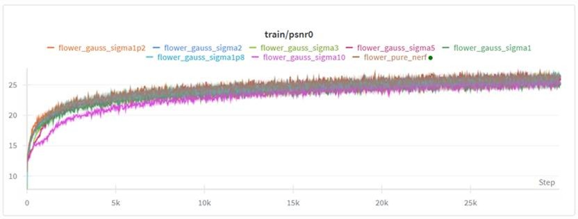
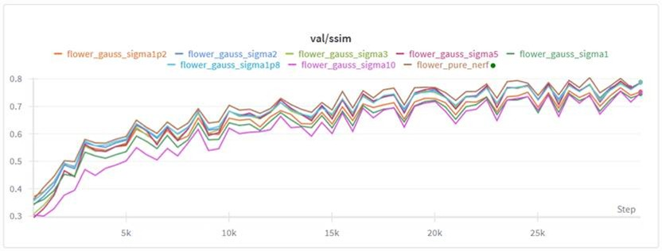
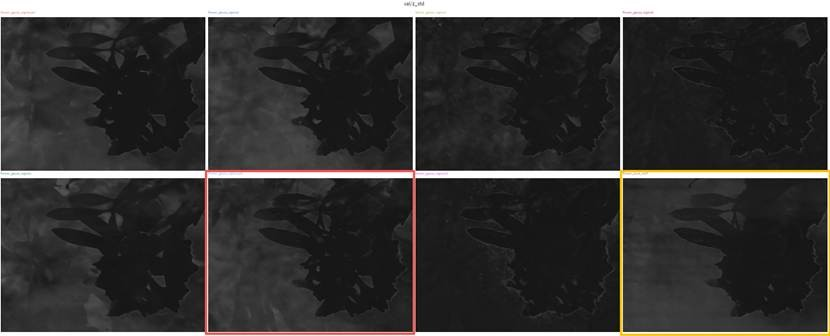

---

## 3. σ = 1.8 with Learnable Fourier Frequencies

On top of the σ = 1.8 Gaussian baseline, we enabled learnable Fourier frequencies. In this setting, the frequency matrix of the Gaussian encoding is optimized jointly with the NeRF network parameters. The results show that:

- training PSNR converges slightly slower in the early iterations,  
- but by the end of training, train PSNR and val PSNR/SSIM are almost indistinguishable from the fixed-Gaussian baseline, and  
- the rendered images and z_std maps are also visually very similar.

Thus, making the Gaussian frequencies learnable brings almost no benefit in this experiment. This indicates that the fixed Gaussian encoding with σ = 1.8 already provides a good frequency distribution for this scene; additional learnable degrees of freedom are not the limiting factor for performance and mainly add optimization complexity.
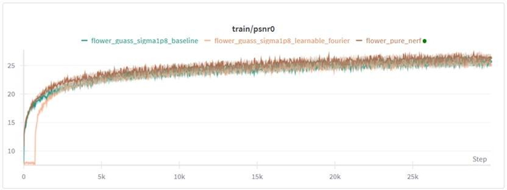
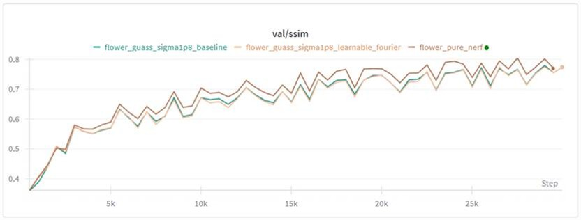
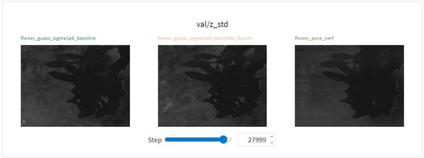

---

## 4. σ = 1.8 with Learnable Frequencies and Phases

We further extended the previous setup by also making the phases learnable in addition to the frequencies. Compared to “σ = 1.8 + learnable frequencies”:

- early-stage convergence in train PSNR improves slightly and becomes closer to the pure NeRF curve,  
- however, final PSNR and SSIM remain clearly below pure NeRF and are almost identical to the “learnable-frequencies-only” model, and  
- edge sharpness is still improved relative to pure NeRF but not noticeably better than the σ = 1.8 Gaussian baseline.

Theoretically, since we already use both sin and cos components, later linear layers can absorb arbitrary phase shifts. The experiments confirm this: explicitly learning phases changes the training dynamics a bit but does not materially change the final reconstruction quality. In this task, learnable phase is therefore not a key performance factor.
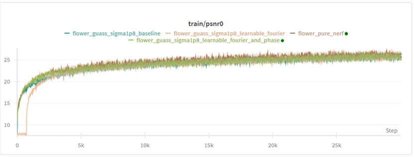
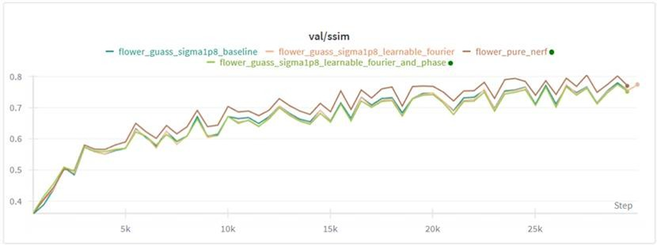
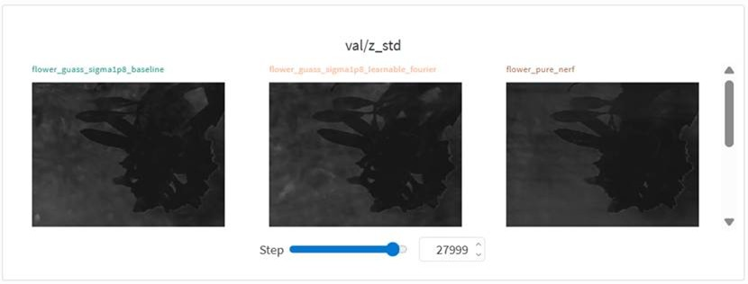

---

## Overall Summary

Changing the positional encoding from the original NeRF log-bands to alternative Fourier encodings (including learnable ones) does not significantly change performance on this scene; the baseline encoding is already strong.

Introducing Gaussian Fourier features with σ = 1.8 substantially sharpens object boundaries and depth structure, giving higher perceptual quality, while PSNR/SSIM drop only slightly due to the ground truth itself being somewhat blurred.

Further adding learnable frequencies and phases on top of the σ = 1.8 Gaussian encoding yields almost no additional gains; these extra parameters mainly affect early training behavior but converge to nearly the same solution.

In short, the most effective modification in this study is the fixed Gaussian Fourier encoding with σ = 1.8, which improves perceived 3D sharpness at only a very small cost in traditional image-similarity metrics.
